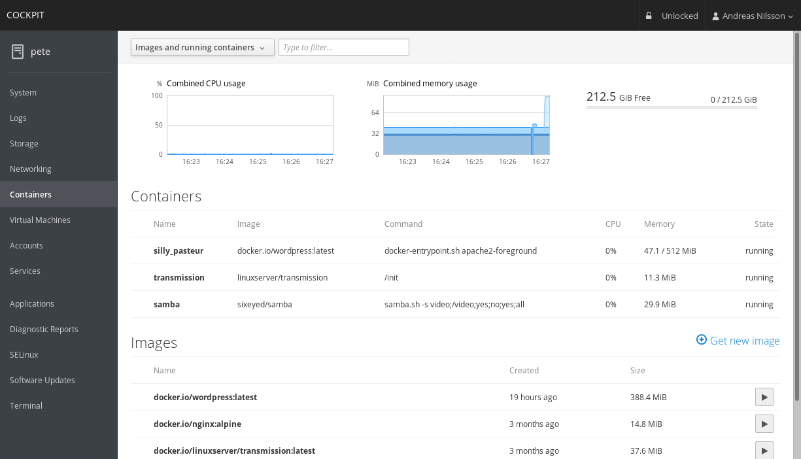

# Gerencie seu cluster Kubernetes com Cockpit project

<p align="center">
  
</p>

### Requisitos:

#### Cluster com 03 servers
```
k8s-master - Centos 7 - 2vCPU - 8GBram - 10GB Disco
k8s-worker1 - Centos 7 - 2vCPU - 8GBram - 10GB Disco
k8s-worker2 - Centos 7 - 2vCPU - 8GBram - 10GB Disco
```

#### Atualizar e instale os seguites pacotes:
```
# yum update -y && yum upgrade -y && yum -y install epel-release net-tools wget curl
```

#### Instalar o Docker:
```
# curl -fsSL https://get.docker.com | bash
```

#### Iniciar e criar regra de inicialização automatica do Docker:
```
# systemctl enable docker && systemctl start docker && systemctl status docker
```

#### Insira o repositório do Kubernetes:
```
cat <<EOF > /etc/yum.repos.d/kubernetes.repo
[kubernetes]
name=Kubernetes
baseurl=https://packages.cloud.google.com/yum/repos/kubernetes-el7-x86_64
enabled=1
gpgcheck=1
repo_gpgcheck=1
gpgkey=https://packages.cloud.google.com/yum/doc/yum-key.gpg https://packages.cloud.google.com/yum/doc/rpm-package-key.gpg
EOF
```

#### Parar o Firewall interno:
```
# setenforce 0

# systemctl stop firewalld

# systemctl disable firewalld
```

#### Instale os pacotes do Kubernetes:
```
# yum install -y kubelet kubeadm kubectl
```

#### Ativar e criar regra de inicialização automatica do Kubernetes:
```
# systemctl enable kubelet && systemctl start kubelet && systemctl status kubelet
```

#### Insira no arquivo Sysctl as instruções abaixo:
```
# vi /etc/sysctl.conf

net.bridge.bridge-nf-call-ip6tables = 1

net.bridge.bridge-nf-call-iptables = 1
```

#### Aplique as regras do sysctl
```
# sysctl --system
```

#### Configure as regras: 
```
# modprobe br_netfilter
```
```
# echo '1' > /proc/sys/net/bridge/bridge-nf-call-iptables
```
#### Insira as informações abaixo no arquivo Kubelet:
```
# vi /etc/sysconfig/kubelet

KUBELET_EXTRA_ARGS=cgroup-driver=cgroupfs
```

#### Aplique as regras do Kubelet
```
# systemctl daemon-reload

# systemctl restart kubelet
```
#### Desative o swap no sistema:
```
# swapoff -a
```

#### Remova a linha do Swap caso exista no arquivo FSTAB:
```
# vi /etc/fstab
```

#### Inicie o cluster Kubernetes apenas no node Master:
```
# kubeadm init
```
#### Insira as instruções abaixo no perfil de usuário que utilizará o Kubernetes:
```
# mkdir -p $HOME/.kube

# sudo cp -i /etc/kubernetes/admin.conf $HOME/.kube/config

# sudo chown $(id -u):$(id -g) $HOME/.kube/config
```
#### Instale o gerenciador de rede WeaveNet:
```
# kubectl apply -f "https://cloud.weave.works/k8s/net?k8s-version=$(kubectl version | base64 | tr -d '\n')"
```

#### Acesse os nodes Workers e adicione-os no cluster que foi gerado no node Master, com:
```
kubeadm join xxx.xxx.xxx.xxx:xxxx --token xxxx.xxxxxxxxxxxxxxx \
    --discovery-token-ca-cert-hash sha256:xxxxxxxxxxxxxxxxxxxxxxxxxxxxxxxxxxxxxxxxxxxxx
```

#### Listar os pods do Kubernetes:
```
# kubectl get pods -n kube-system
```

#### Liste todos os nodes com:
```
# kubectl get nodes
```

## Instalando o Cockpit project:


#### Instale os pacotes abaixo:
```
# yum install -y cockpit cockpit-networkmanager cockpit-dashboard cockpit-storaged cockpit-packagekit cockpit-docker cockpit-kubernetes cockpit-machines cockpit-sosreport cockpit-selinux cockpit-kdump cockpit-subscriptions cockpit-pcp
```
#### Iniciar e criar regra de inicialização automatica do Cockpit:
```
# systemctl start cockpit && systemctl enable cockpit.socket 
```

#### Para acessar nossa interface web: 

```
<ip_do_servidor>:9090
```

<p align="center">
  
</p>

#### Login:

Quando o painel do Kubernetes é usado em uma sessão de login padrão do Cockpit, geralmente é necessária alguma forma de autenticação para acessar a API REST do Kubernetes, o Cockpit usa as informações de autenticação e servidor no arquivo abaixo para o usuário conectado. 

```
~/.kube/config 
```

#### Use como um Pod Kubernetes:
O painel do Kubernetes pode ser implantado como um pod no Kubernetes, exigindo que os usuários efetuem login usando a autenticação padrão padrão configurada para acessar sua API.

```
$ wget https://raw.githubusercontent.com/cockpit-project/cockpit/master/containers/kubernetes-cockpit.json
$ kubectl create -f kubernetes-cockpit.json
```
Esse pod pode ser usado no kubernetes configurados com autenticação básica. Por padrão, o pod tenta acessar a API do kubernetes com segurança e espera que o servidor da API do kubernetes tenha sido implantado com uma CA, arquivos de certificado e chave da conta de serviço. Para alterar esse comportamento, edite kubernetes-cockpit.json e altere a variável de ambiente KUBE_INSECURE  para "true".

Você pode recuperar o endereço onde pode acessar o painel via:
```
$ kubectl get service kubernetes-cockpit
```

#### Documentação do Cockpit Project -- latest version disponivel em: http://cockpit-project.org/guide/latest/


